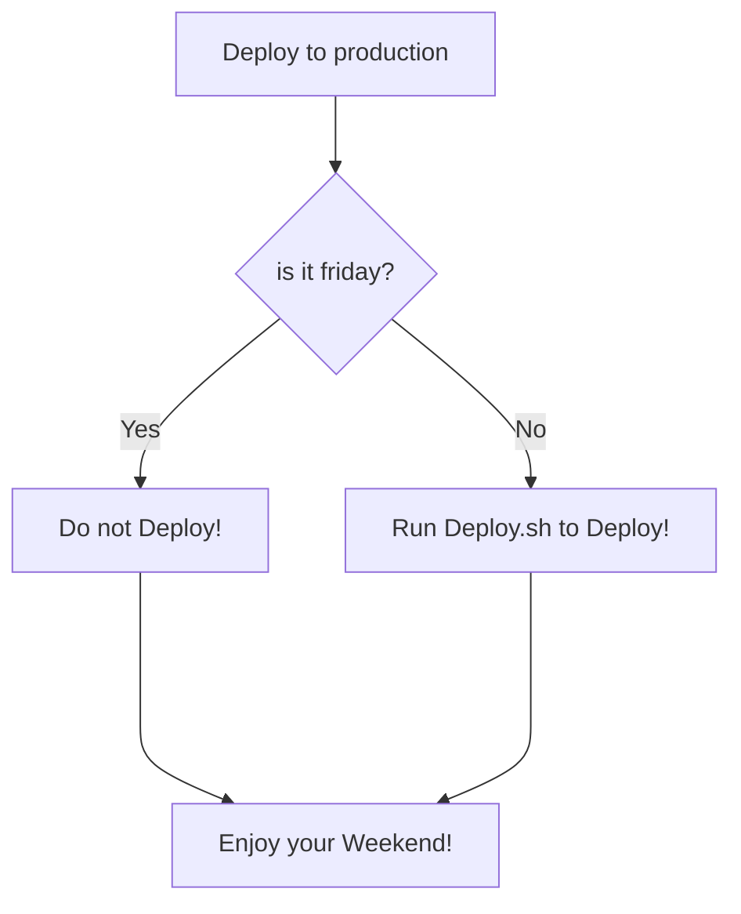

Hi 👋 My name is vivek dogra
============================

Fullstack Javascript Developer ( Angular, React, NodeJS, NextJS)
--------------------------------------------------------

Technical Professional with over 8+yrs of experience in the software industry, offering specialization in designing and developing applications using technologies such as React JS, Angular, Javascript, Typescript, NodeJS(Express, Sails), HTML5, Bootstrap3, CSS3, responsive web design, SASS etc.
#### Also having basic knowledge for AWS, Python, Docker, Mongodb, Heroku, Firebase.

* 🌍  I'm based in India
* ✉️  You can contact me at [vivekdogra02@gmail.com](mailto:vivekdogra02@gmail.com)
* 🧠  I'm learning Next JS, Tailwind CSS, AWS, Docker.
* 🤝  I'm open to collaborating on Whatever new comes up, i am ready to work on.
* ⚡  JS Lover - Passionately learning new tech and also get some time to solve leetcode and hackerrank problems to understand the data structures and algorithms. Meanwhile, usually spend time in writing blogs on medium.

### Skills

### Socials

    

### Badges

<b>My GitHub Stats</b>

<b>Top Repositories</b>

  

      

       
